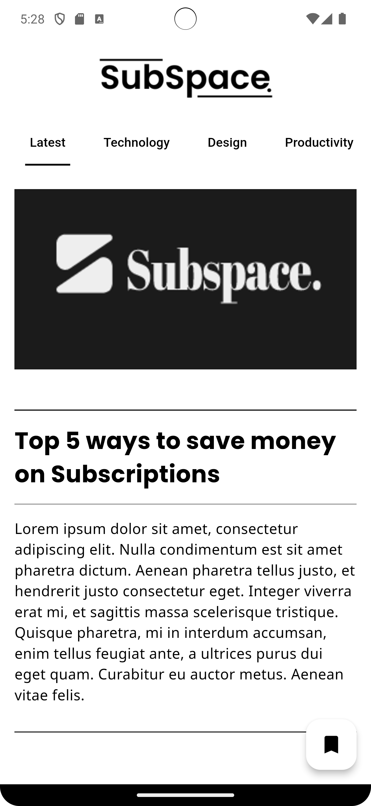
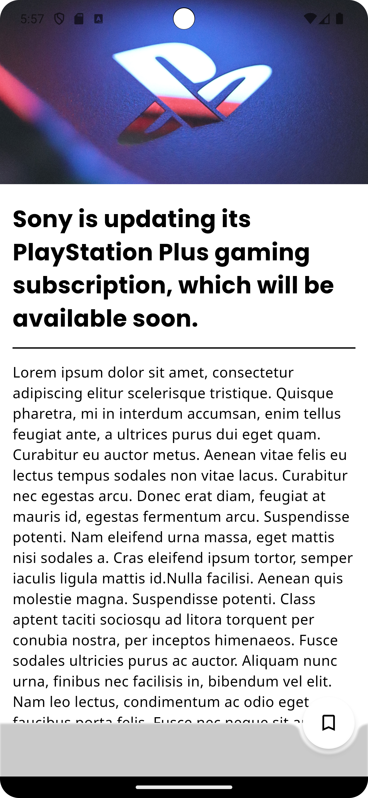

# Subspace Blog

Subspace Blog is a Flutter-based blogging application that allows users to explore, read, and bookmark blogs. The app is designed with a clean, responsive UI and incorporates state management using Bloc and Cubit for efficient performance.

---

## Features

### Home Page
- Displays a list of blogs fetched from an API.
- Category filters using an interactive `ChoiceChip` UI.
- Seamless navigation to the article and favourites pages.

### Article Page
- Showcases blog details (title, image, and description).
- Allows users to bookmark their favorite blogs.
- Implements smooth hero animations for transitions.

### Favourites Page
- Lists all bookmarked blogs for quick access.
- Handles scenarios like empty bookmarks with user-friendly messages.

---

## Installation

To run this project locally, follow these steps:

1. Clone the repository:
   ```bash
   git clone https://github.com/your-username/subspace_blog.git
   ```

2. Navigate to the project directory:
   ```bash
   cd subspace_blog
   ```

3. Install the dependencies:
   ```bash
   flutter pub get
   ```

4. Run the application:
   ```bash
   flutter run
   ```

---

## Screenshots

### Home Page


### Article Page


### Favourites Page


## License

This project is licensed under the MIT License. See the [LICENSE](LICENSE) file for details.

---

## Contact

For any queries or feedback, feel free to contact:
- **Email**: abhi.codescode.com
- **GitHub**: [Abhi-codesCode](https://github.com/Abhi-CodesCode)
